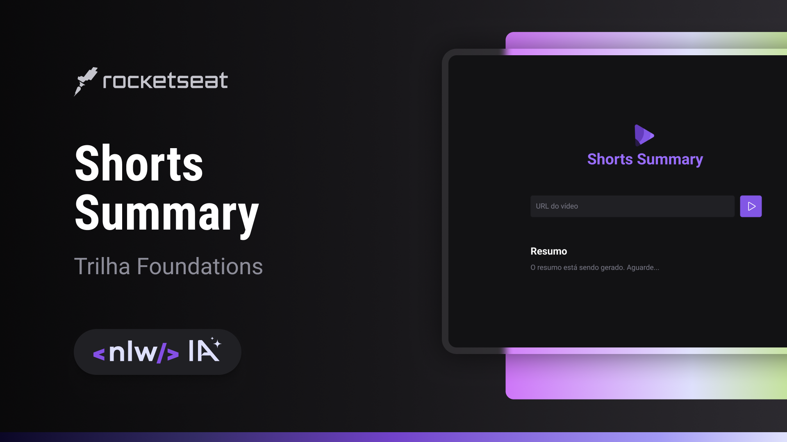

  

## 🖥️ Project

This is a project using AI to summarize and transcribe Shorts by receiving a youtube URL.

## 🚀 Technologies

This project was developed during the Rocketseat's NLW-AI using the following technologies:

- HTML
- CSS
- JavaScript
- Git e Github
- AI models: Bart and Whisper 

## 🔖 Layout

You can see the project layout through
[here](https://www.figma.com/community/file/1282823495335498952/Shorts-Summary-•-Trilha-Foundations).
You must have an account at [Figma](https://www.figma.com)
